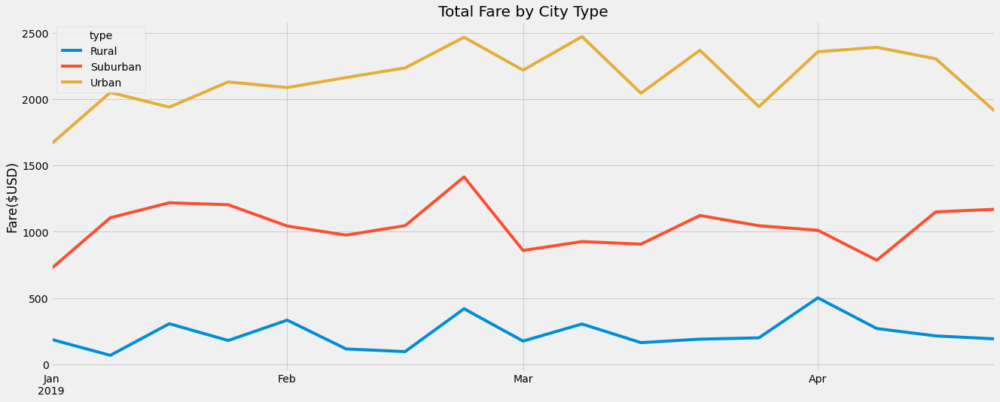

# PyBer_Analysis
## Overview of the analysis
The purpose of this analysis was to create a summary DataFrame of the ride-sharing data by city type (urban, suburban, and rural) and create a multiple-line graph that shows the total weekly fares for each city type.
## Results
### What were the differences in ride-sharing data among the different city types?

The summary DataFrame  and highlighted the following:

<b>Total Rides:</b>

&nbsp;&nbsp;•	Urban cities had the most total rides, with 68.4% of the total rides.

&nbsp;&nbsp;•	Suburban cities were in the middle with 26.3% of the total rides.

&nbsp;&nbsp;•	Rural cities had the least total rides, with only 5.3% of the total rides.

<b>Total Drivers:</b>

&nbsp;&nbsp;•	Urban cities had the greatest number of  drivers, with 80.9% of the total drivers.

&nbsp;&nbsp;•	Suburban cities were in the middle with 16.5% of the total drivers.

&nbsp;&nbsp;•	Rural cities had the least number of drivers, with only 2.6% of the total drivers.

<b>Total Fares:</b>

&nbsp;&nbsp;•	Urban cities had the most total fares, with 62.7% of the total fares

&nbsp;&nbsp;•	Suburban cities were again in the middle with 30.5% of the total fares.

&nbsp;&nbsp;•	Rural cities had the smallest total fares, with 6.8% of the total fares.

<b>Average Fare per Ride:</b>

&nbsp;&nbsp;•	Rural cities had the highest average fare per ride at $34.62.

&nbsp;&nbsp;•	Suburban cities had the 2nd highest average fare per ride at $30.97.

&nbsp;&nbsp;•	Urban cities had the lowest average fare per ride at $24.53.

<b>Average Fare per Driver:</b>

&nbsp;&nbsp;•	Rural cities had highest average fare per driver at $55.49.

&nbsp;&nbsp;•	Suburban cities had the 2nd highest average fare per driver at $39.50.

&nbsp;&nbsp;•	Urban cities had the lowest average fare per driver at $16.57.

## Summary
Based on the results, I would recommend  the following:  (1) I think it would be beneficial for Pyber to try recruiting more drivers in suburban and rural cities.  (2) I also think it might be worthwhile to lower fare prices in suburban and rural cities to see if demand increases.  (3) Lastly, I would try increasing fares in urban cities to see how this affects overall profit. 

